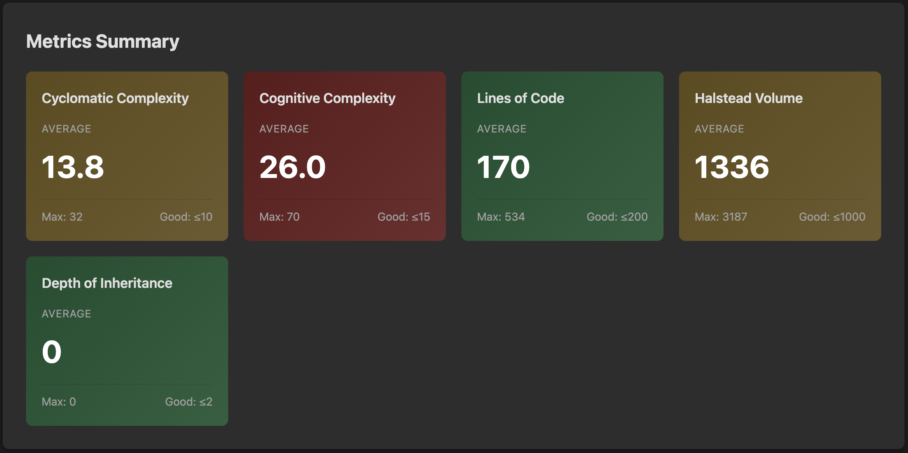

# Splendid Code Quality

A Dart CLI tool for analyzing and measuring code quality in Dart projects.

## Overview

Splendid Code Quality helps software engineers understand and improve the quality of their Dart codebases through industry-standard quality metrics and analysis techniques. The tool focuses on measurement and insight rather than automatic code modification, empowering developers to make informed decisions about code improvements.

## Key Features

- **Quality Metrics Analysis**: Measure code quality using established industry-standard metrics
- **Flexible Usage**: Run as a standalone CLI tool or integrate as a Dart analyzer plugin
- **Clear Reporting**: Generate easy-to-understand analysis reports with aesthetic design
- **CI/CD Integration**: Use in automated pipelines for continuous quality monitoring

## HTML Report

Splendid Code Quality generates HTML reports that provide an at-a-glance view of your codebase health. The reports feature:

- **Overview Dashboard**: Quick summary of total files analyzed, lines of code, and files with quality issues
- **Metrics Summary**: Color-coded cards showing average values for each quality metric (green = good, yellow = warning, red = critical)
- **Problem Hotspots**: Top 10 files that need attention, ranked by severity of quality issues
- **Detailed File List**: Complete table of all analyzed files with individual metric scores



The report makes it easy to identify which areas of your codebase need attention and track quality improvements over time.

## Usage

All commands accept a path to a single Dart file or a directory (analyzed recursively).

```bash
dart run splendid_code_quality <command> <file|directory>
```

### Cyclomatic Complexity

```bash
dart run splendid_code_quality complexity lib/
dart run splendid_code_quality complexity lib/src/my_file.dart
```

### Cognitive Complexity

```bash
dart run splendid_code_quality cognitive lib/
dart run splendid_code_quality cognitive lib/src/my_file.dart
```

### Halstead Metrics

```bash
dart run splendid_code_quality halstead lib/
dart run splendid_code_quality halstead lib/src/my_file.dart
```

### Depth of Inheritance

```bash
dart run splendid_code_quality inheritance lib/
dart run splendid_code_quality inheritance lib/src/my_file.dart
```

### Lines of Code

```bash
dart run splendid_code_quality loc lib/
dart run splendid_code_quality loc lib/src/my_file.dart
```

### HTML Report (all metrics)

Generates a combined HTML report covering every metric:

```bash
dart run splendid_code_quality report lib/
dart run splendid_code_quality report lib/ --output my_report.html
```

The output path defaults to `code_quality_report.html`. Use `-o` / `--output` to customize it.

### Help & Version

```bash
dart run splendid_code_quality --help
dart run splendid_code_quality --version
dart run splendid_code_quality complexity --help
```

## Supported Quality Metrics

### Cyclomatic Complexity

Cyclomatic complexity measures the number of independent paths through a program's source code by counting decision points (if statements, loops, case statements, etc.). A function with no branching has a complexity of 1, while each additional decision point increases the complexity.

**How to use this metric:**
- Functions with high complexity (typically >10) are harder to test, understand, and maintain
- Identify candidates for refactoring by breaking complex functions into smaller, focused units
- Set complexity thresholds in CI/CD pipelines to prevent overly complex code from being merged
- Track complexity trends over time to ensure code maintainability doesn't degrade

### Cognitive Complexity

Cognitive complexity measures how difficult code is to understand by penalizing nested structures and control flow breaks more heavily than simple decision points. Unlike cyclomatic complexity which treats all decision points equally, cognitive complexity focuses on human readability by adding extra weight for nesting depth.

**How to use this metric:**
- Functions with high cognitive complexity (typically >15) are difficult for developers to understand and reason about
- Nested control structures contribute more to cognitive load than sequential decisions
- Refactor deeply nested code by extracting inner logic into well-named helper functions
- Use this metric alongside cyclomatic complexity for a complete picture of code maintainability

**What increases cognitive complexity:**
- Control structures (if, for, while, switch) add 1 + current nesting depth
- Nested structures are penalized more heavily (each level adds to the score)
- Control flow breaks (break, continue, return in nested contexts, throw) add 1
- Sequences of logical operators (&&, ||) add 1

### Halstead Metrics

Halstead metrics measure program vocabulary and volume based on the number of unique and total operators and operands in the source code. These metrics provide insight into program size, comprehension difficulty, and development effort.

**Key Halstead measurements:**
- Vocabulary (n): Total number of unique operators and operands
- Length (N): Total count of all operators and operands
- Volume (V): Program size measured in bits, calculated as N × log₂(n)
- Difficulty (D): How hard the program is to write or understand
- Effort (E): Mental effort required to develop or understand the code

**How to use this metric:**
- High volume (typically >1000) indicates large, complex implementations that may need decomposition
- Volume grows with both code length and vocabulary richness
- Use volume alongside LOC to distinguish between verbose and concise code
- Track volume trends to identify areas where abstractions could reduce complexity
- Halstead metrics are often used as components in composite metrics like Maintainability Index

### Depth of Inheritance

Depth of inheritance measures how many levels deep a class hierarchy extends. Each level of inheritance adds to the depth, making the codebase harder to understand as changes to base classes can have cascading effects throughout the hierarchy.

**How to use this metric:**
- Deep hierarchies (typically >5 levels) are difficult to understand and maintain
- Each inheritance level adds cognitive load when reasoning about class behavior
- Prefer composition over deep inheritance to reduce coupling
- Identify overly complex hierarchies that could be flattened or refactored
- Classes with no explicit superclass or extending Object have depth 0

**When inheritance depth is problematic:**
- Changes to base classes require understanding all derived classes
- Testing becomes more complex as you need to consider the entire hierarchy
- New developers struggle to understand the full behavior of derived classes
- Bug fixes in base classes can have unexpected effects on subclasses

### Lines of Code (LOC)

Lines of Code measures the size of code units (functions, classes, files) by counting non-blank, non-comment source lines. This metric provides insight into code volume and potential maintenance burden.

**How to use this metric:**
- Long functions (typically >50 LOC) often indicate multiple responsibilities and refactoring opportunities
- Large files (typically >500 LOC) may benefit from being split into smaller, more focused modules
- Compare LOC across similar components to identify inconsistencies in implementation approach
- Monitor LOC growth in specific areas to detect feature creep or architectural drift
